# Documentación Técnica: Laboratorio de Trunk-Based Development (TBD) y CI/CD

> **Autor:** Jhardiher José Giraldo Muñoz (`MunGZar`)  
> **Proyecto Principal:** SegurityMZManager  
> **Repositorio de Práctica:** `juanpablogarcia2020/bd`  
> **Metodología:** Scrum + Trunk-Based Development  
> **Herramientas:** Git, GitHub Actions, GitHub Rulesets, GHCR (Docker)  
> **Fecha:** Septiembre 2026  

---

## 1. Resumen y Objetivos del Laboratorio

El propósito de este laboratorio es implementar de manera práctica la metodología **Trunk-Based Development (TBD)** en conjunto con un pipeline de **Integración Continua (CI) y Despliegue Continuo (CD)** sobre GitHub Actions, custodiado por **GitHub Rulesets**.

### Objetivos Clave:
1. **Desacoplamiento Arquitectónico:** Separar el pipeline en dos fases: validación y pruebas (`test`) y compilación/publicación de imágenes Docker (`build_and_push`).
2. **Seguridad y Menor Privilegio:** Reducir los permisos globales de GitHub Actions (`contents: read`) y conceder `packages: write` únicamente al job de despliegue en la rama troncal.
3. **Protección de la Rama Principal (`main`):** Configurar reglas estrictas para impedir pushes directos, exigir Pull Requests con aprobación y requerir que los checks automatizados pasen antes del merge.
4. **Validación del Flujo de Trabajo:** Ejecutar una rama corta, simular un cambio atómico, validar el bloqueo del merge, ejecutar los checks de CI, fusionar mediante *Squash and Merge* y verificar el empaquetado automático hacia GHCR.
5. **Higiene de Ramas (Branch Hygiene):** Entender por qué nunca debe eliminarse una rama hasta confirmar que el estado sea efectivamente *Merged*.

---

## 2. Marco Teórico: Trunk-Based Development vs. GitFlow

| Criterio | GitFlow Tradicional | Trunk-Based Development (TBD) |
| :--- | :--- | :--- |
| **Duración de Ramas** | Larga (semanas o meses con `develop`, `feature`, `release`) | Muy corta (horas o 1 día directamente sobre `main`) |
| **Frecuencia de Integración** | Baja (al cierre de sprint) | Continua (diaria o varias veces por día) |
| **Conflictos de Merge** | Masivos y complejos (*Merge Hell*) | Mínimos gracias a lotes pequeños (*Small Batches*) |
| **Definition of Done (Scrum)** | Verificación manual tardía | Automatizada: commit en `main` probado y desplegable |

---

## 3. Fase 1: Reestructuración y Refactorización del Pipeline de CI/CD

### Paso 1: Renombrar el Workflow con Git
Se renombró formalmente el archivo de workflow de `.github/workflows/test_and_buil.yaml` a `.github/workflows/ci.yaml` usando `git mv`:
```bash
git status
git mv .github/workflows/test_and_buil.yaml .github/workflows/ci.yaml
git status
```
*Justificación:* `git mv` preserva el historial de commits y permite identificar el renombramiento sin romper la trazabilidad.

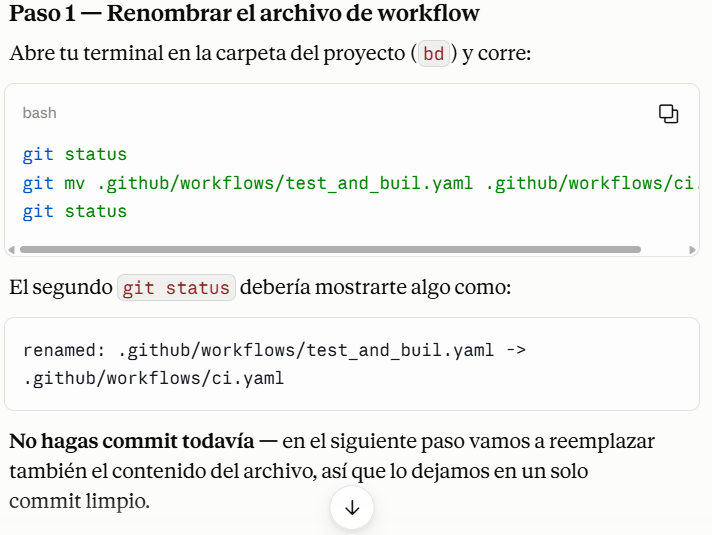

---

### Paso 2: Inspección del Archivo Actual
Se revisó la estructura previa para preservar variables y versiones clave:
```bash
cat .github/workflows/ci.yaml
```

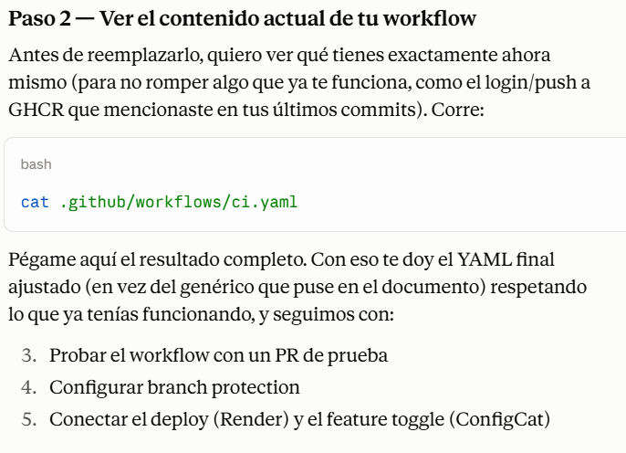
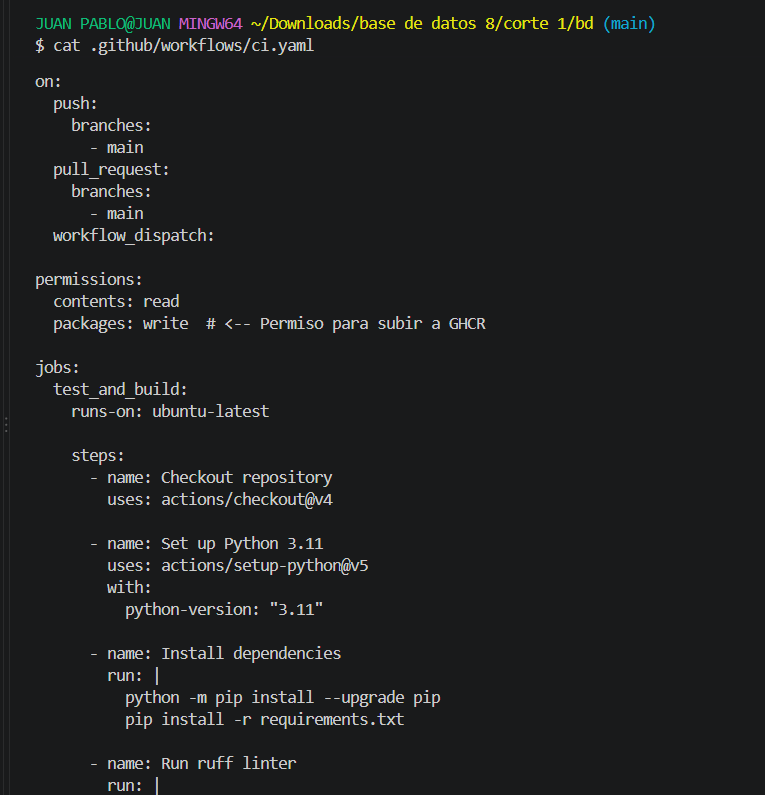

---

### Paso 3: División en Dos Jobs (`test` y `build_and_push`)
El workflow original combinaba pruebas y publicación en un solo paso. Se desacopló en dos etapas independientes:

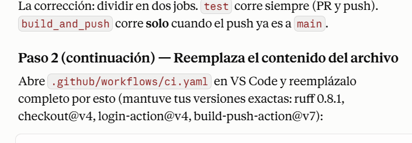

#### Código Final del Pipeline (`ci.yaml`):
```yaml
name: Test and Build

on:
  push:
    branches:
      - main
  pull_request:
    branches:
      - main
  workflow_dispatch:

jobs:
  test:
    runs-on: ubuntu-latest
    permissions:
      contents: read

    steps:
      - name: Checkout repository
        uses: actions/checkout@v4

      - name: Set up Python 3.11
        uses: actions/setup-python@v5
        with:
          python-version: "3.11"

      - name: Install dependencies
        run: |
          python -m pip install --upgrade pip
          pip install -r requirements.txt

      - name: Run ruff linter
        run: |
          pip install ruff==0.8.1
          ruff check .

      - name: Run tests
        run: |
          pytest tests.py

  build_and_push:
    needs: test
    if: github.ref == 'refs/heads/main' && github.event_name == 'push'
    runs-on: ubuntu-latest
    permissions:
      contents: read
      packages: write  # <-- Permiso exclusivo para GHCR

    steps:
      - name: Checkout repository
        uses: actions/checkout@v4

      - name: Login to GitHub Container Registry
        uses: docker/login-action@v4
        with:
          registry: ghcr.io
          username: ${{ github.actor }}
          password: ${{ secrets.GITHUB_TOKEN }}

      - name: Build and push Docker image
        uses: docker/build-push-action@v7
        with:
          context: .
          push: true
          tags: ghcr.io/${{ github.repository }}:latest
```

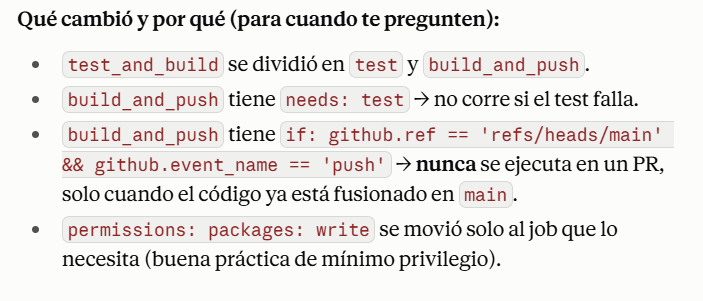

---

### Paso 4: Preparación, Commit y Push a Main
```bash
git add .github/workflows/ci.yaml
git status
git commit -m "refactor(ci): separar job de test y build_and_push; build_and_push solo corre en push a main"
git push origin main
```

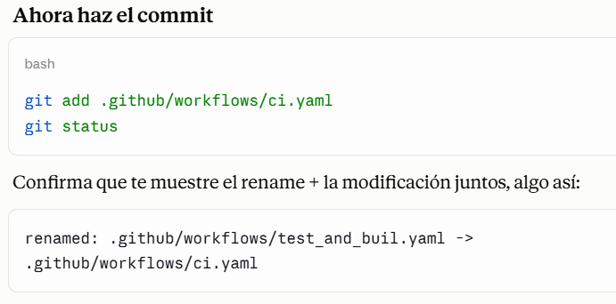
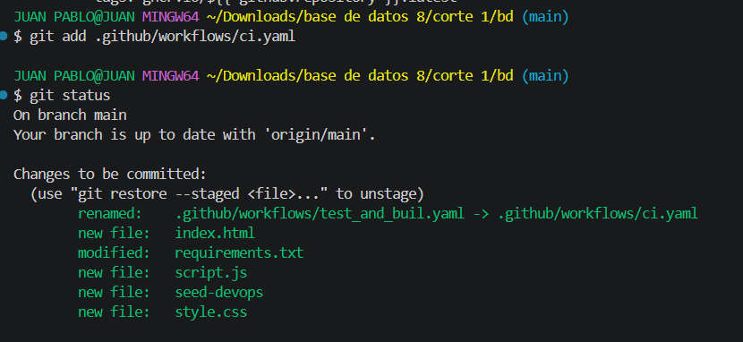
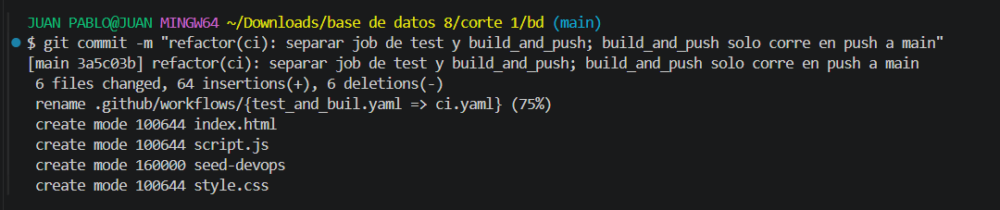
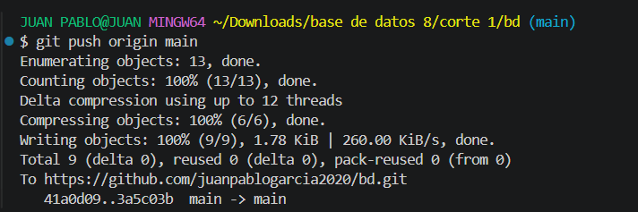

---

## 4. Fase 2: Configuración de Gobernanza con GitHub Rulesets

Para garantizar la estabilidad de `main`, se configuraron reglas modernas de protección (*Rulesets*):

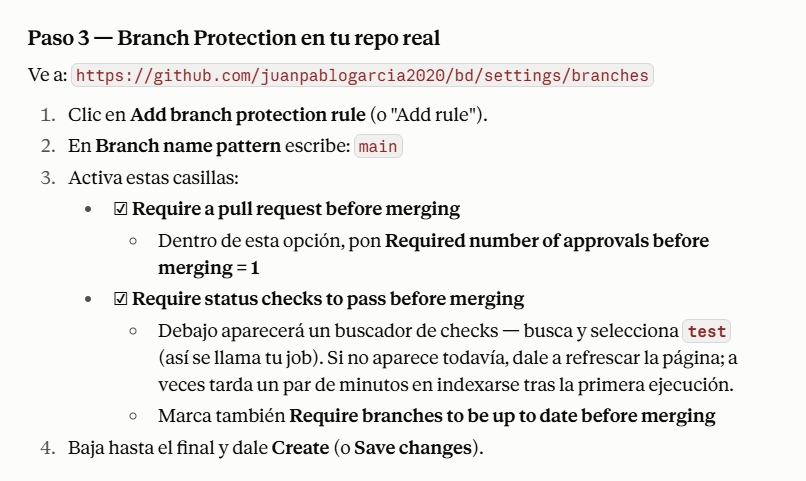

### Creación del Ruleset:
- **Nombre:** `main`
- **Estado:** `Active`
- **Ramas Destino:** `Include default branch` (`main`)

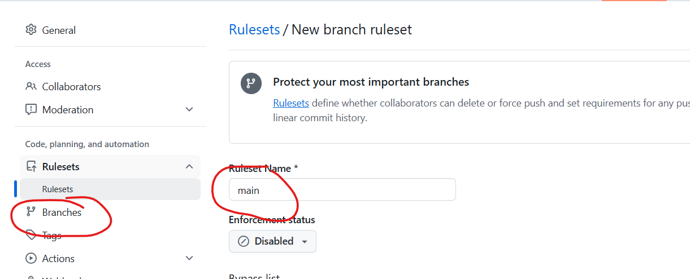
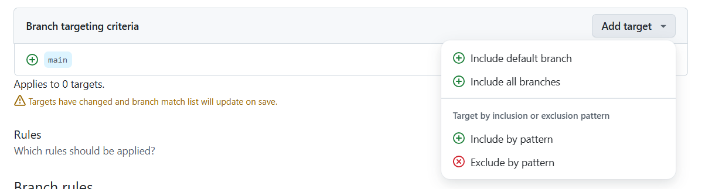
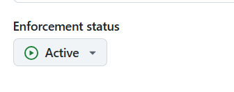

### Reglas de Calidad Configuradas:
1. **Require a pull request before merging:** 1 aprobación requerida.
2. **Require status checks to pass before merging:** Check obligatorio `test` (GitHub Actions) y ramas actualizadas.
3. **Block force pushes:** Prohíbe reescrituras del historial.

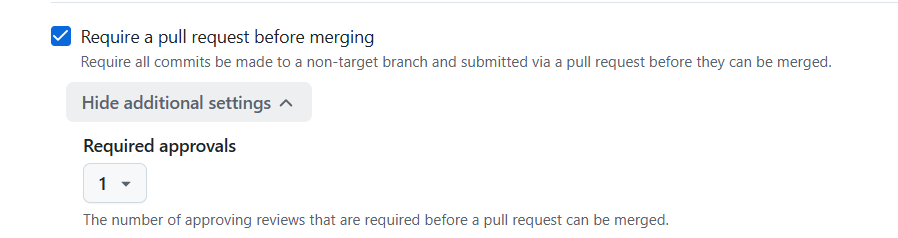
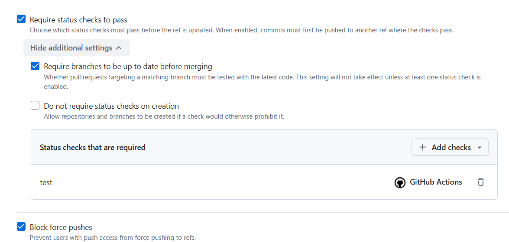

### Gestión de Excepciones (Bypass List) para Proyectos Unipersonales:
Se asignó el rol `Repository admin` a la Bypass List para evitar bloqueos insalvables cuando no hay revisores externos, permitiendo auditoría completa.

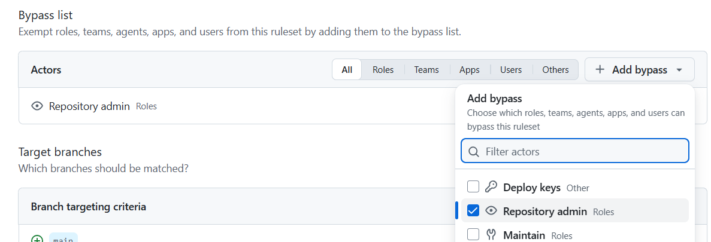
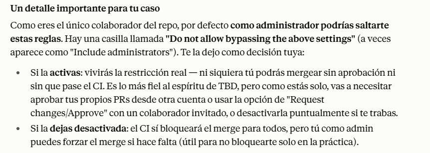
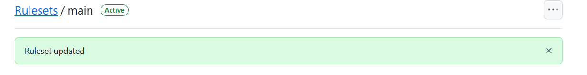

---

## 5. Fase 3: Verificación del Ciclo TBD con Pull Request en Vivo

### Paso 5: Creación de Rama de Vida Corta y Cambio Atómico
```bash
git checkout -b test/verificar-branch-protection
echo "# prueba de branch protection" >> main.py
git add main.py
git commit -m "test: verificar que el ruleset bloquea merge directo"
git push origin test/verificar-branch-protection
```

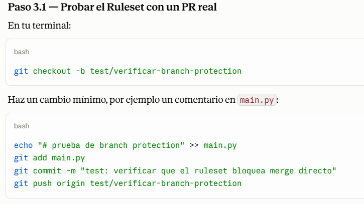
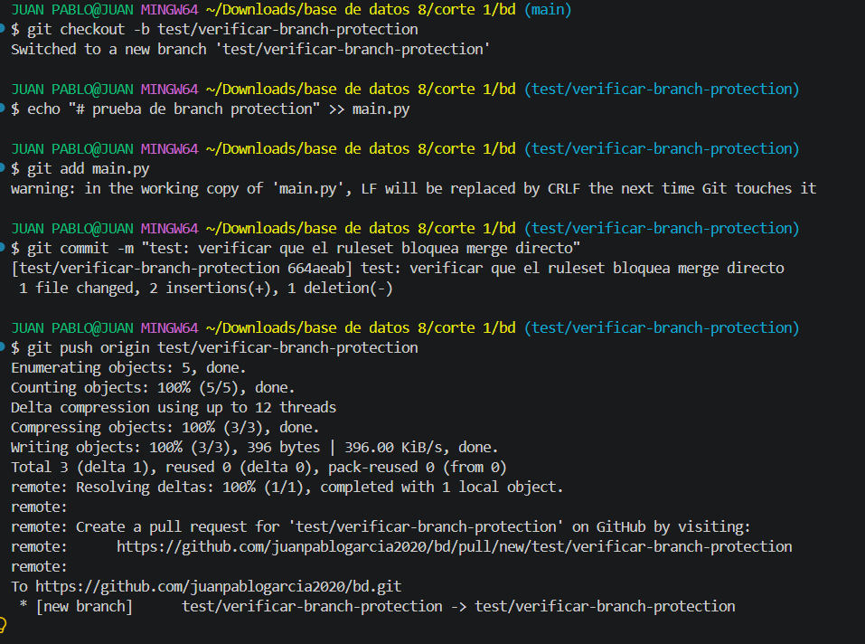

---

### Paso 6: Apertura del Pull Request y Verificación de Bloqueos
Al abrir el PR #1 en GitHub, se comprueba:
1. El merge está bloqueado (*Review required*).
2. El job `test` corre y aprueba en 10s.
3. El job `build_and_push` queda en estado `Skipped` (no se construye la imagen durante la fase de PR).

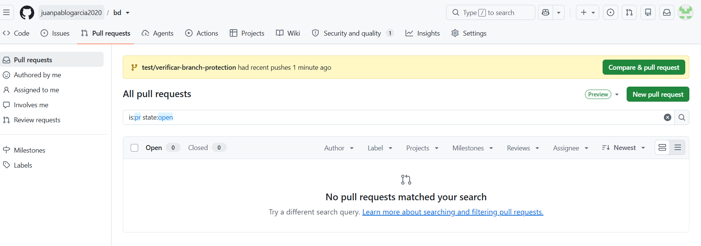
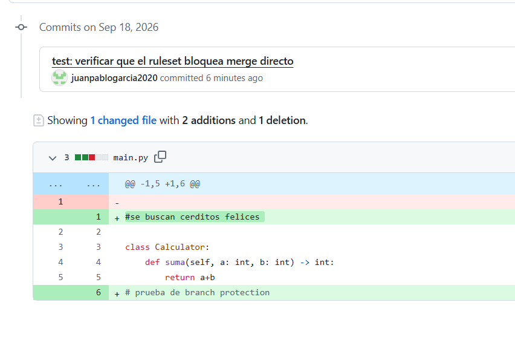
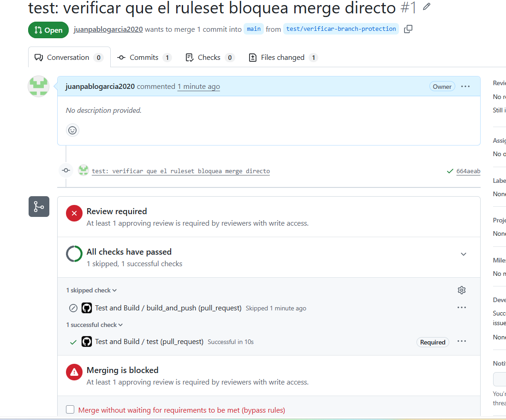

---

### Paso 7: Fusión Controlada (Squash and Merge) y Activación de CD
Se utilizó el bypass administrativo para aplicar **Squash and Merge**, manteniendo el árbol de Git lineal:

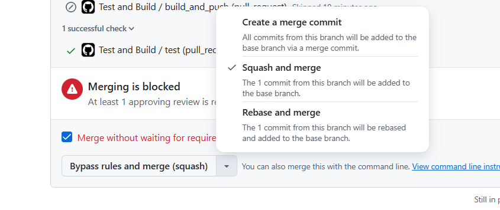
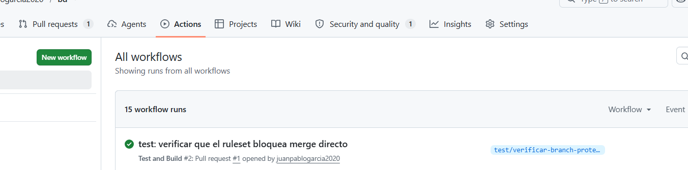
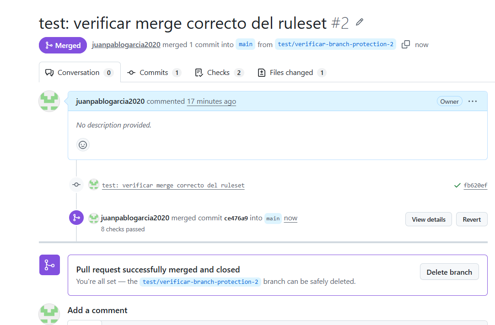

Inmediatamente al integrarse en `main`, el evento `push` activó el job `build_and_push`, publicando la imagen Docker en GHCR:

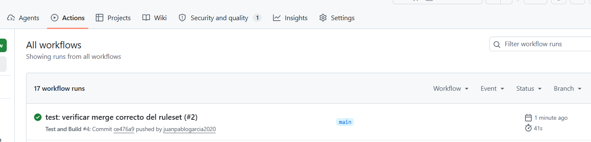

---

### Paso 8: Higiene de Ramas (Branch Hygiene) y Limpieza
Una vez verificado el estado *Merged*, se procedió a la sincronización y borrado seguro:
```bash
git checkout main
git pull origin main
git branch -D test/verificar-branch-protection-2
git push origin --delete test/verificar-branch-protection-2
```

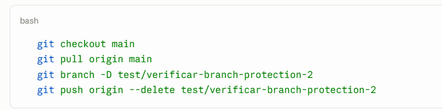
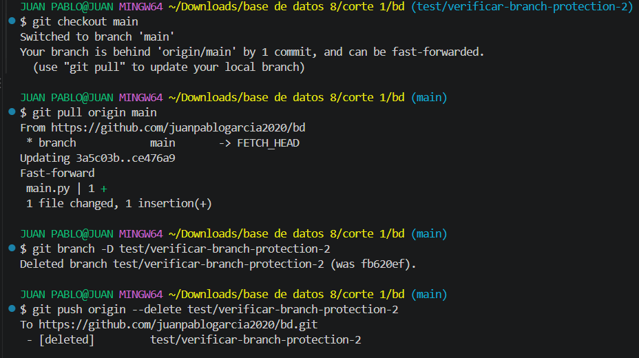
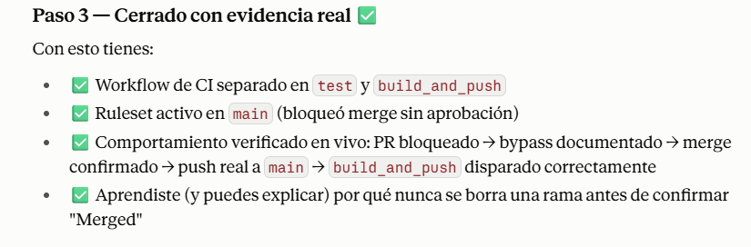

---

## 6. Mapeo y Aplicación al Proyecto Real (SegurityMZManager)

En el proyecto **SegurityMZManager** (`MunGZar/SegurityMZManager`), el archivo `.github/workflows/ci-cd.yml` implementa esta misma arquitectura:
- Job `backend`: Pruebas Jest y compilación NestJS.
- Job `frontend`: Compilación Next.js con Turbopack.
- Job `publish-packages`: `needs: [backend, frontend]` y condición `github.ref == 'refs/heads/main' && (github.event_name == 'push' || github.event_name == 'workflow_dispatch')` para publicar contenedores en GHCR (`ghcr.io/mungzar/seguritymzmanager/...`).

Esto permite al equipo integrar continuamente funcionalidades (catálogo Dahua/Imou, cotizaciones, gestión de clientes) sin temor a romper producción.

---

## 7. Conclusiones
1. **Flujo Ágil y Predecible:** Trunk-Based Development elimina los problemas de integración masiva de fin de sprint.
2. **Seguridad Robusta:** El aislamiento de permisos (`packages: write`) previene riesgos de suministro de software en GitHub Actions.
3. **Definition of Done Confiable:** La combinación de CI automatizado y Rulesets garantiza que cada commit en `main` sea un incremento potencialmente desplegable.